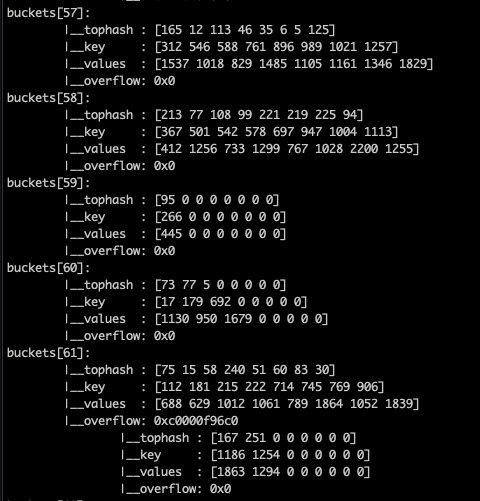
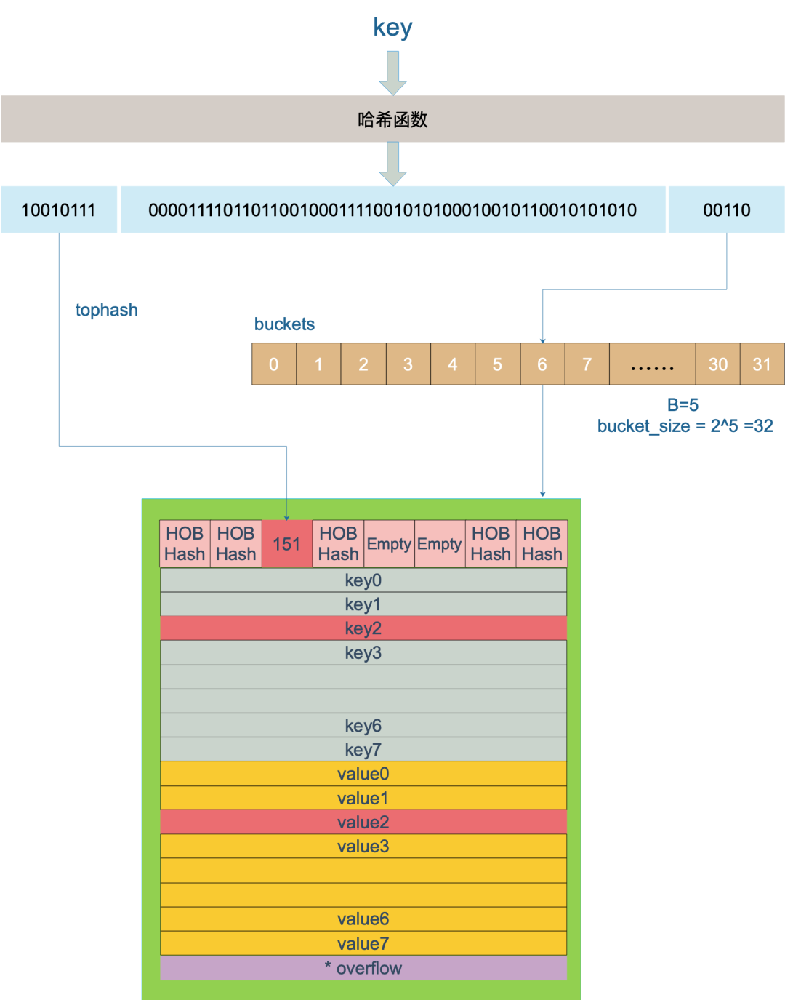

# 面试题 

1. map的底层实现原理
2. 为什么遍历map是无序的？
3. 如何实现有序遍历map？
4. 为什么Go map是非线程安全的？
5. 线程安全的map如何实现?
6. Go sync.map 和原生 map 谁的性能好，为什么？
7. 为什么 Go map 的负载因子是 6.5？
8. map扩容策略是什么?

# 实现原理

Go中的map是一个指针，占用8个字节，指向hmap结构体;  源码`src/runtime/map.go`中可以看到map的底层结构

每个map的底层结构是hmap，hmap包含若干个结构为bmap的bucket数组。每个bucket底层都采用链表结构。接下来，我们来详细看下map的结构

## hmap结构体 

```
// A header for a Go map.
type hmap struct {
    count     int 
    // 代表哈希表中的元素个数，调用len(map)时，返回的就是该字段值。
    flags     uint8 
    // 状态标志，下文常量中会解释四种状态位含义。
    B         uint8  
    // buckets（桶）的对数log_2
    // 如果B=5，则buckets数组的长度 = 2^5=32，意味着有32个桶
    noverflow uint16 
    // 溢出桶的大概数量
    hash0     uint32 
    // 哈希种子

    buckets    unsafe.Pointer 
    // 指向buckets数组的指针，数组大小为2^B，如果元素个数为0，它为nil。
    oldbuckets unsafe.Pointer 
    // 如果发生扩容，oldbuckets是指向老的buckets数组的指针，老的buckets数组大小是新的buckets的1/2;非扩容状态下，它为nil。
    nevacuate  uintptr        
    // 表示扩容进度，小于此地址的buckets代表已搬迁完成。

    extra *mapextra 
    // 这个字段是为了优化GC扫描而设计的。当key和value均不包含指针，并且都可以inline时使用。extra是指向mapextra类型的指针。
 }
```

## bmap结构体

`bmap` 就是我们常说的“桶”，一个桶里面会最多装 8 个 key，这些 key 之所以会落入同一个桶，是因为它们经过哈希计算后，哈希结果是“一类”的，关于key的定位我们在map的查询和插入中详细说明。在桶内，又会根据 key 计算出来的 hash 值的高 8 位来决定 key 到底落入桶内的哪个位置（一个桶内最多有8个位置)。

```
// A bucket for a Go map.
type bmap struct {
    tophash [bucketCnt]uint8        
    // len为8的数组
    // 用来快速定位key是否在这个bmap中
    // 桶的槽位数组，一个桶最多8个槽位，如果key所在的槽位在tophash中，则代表该key在这个桶中
}
//底层定义的常量 
const (
    bucketCntBits = 3
    bucketCnt     = 1 << bucketCntBits
    // 一个桶最多8个位置
）

但这只是表面(src/runtime/hashmap.go)的结构，编译期间会给它加料，动态地创建一个新的结构：

type bmap struct {
  topbits  [8]uint8
  keys     [8]keytype
  values   [8]valuetype
  pad      uintptr
  overflow uintptr
  // 溢出桶
}
```

bucket内存数据结构可视化如下：

注意到 key 和 value 是各自放在一起的，并不是 `key/value/key/value/...` 这样的形式。源码里说明这样的好处是在某些情况下可以省略掉 padding字段，节省内存空间。



## mapextra结构体 

当 map 的 key 和 value 都不是指针，并且 size 都小于 128 字节的情况下，会把 bmap 标记为不含指针，这样可以避免 gc 时扫描整个 hmap。但是，我们看 bmap 其实有一个 overflow 的字段，是指针类型的，破坏了 bmap 不含指针的设想，这时会把 overflow 移动到 extra 字段来。

```
// mapextra holds fields that are not present on all maps.
type mapextra struct {
    // 如果 key 和 value 都不包含指针，并且可以被 inline(<=128 字节)
    // 就使用 hmap的extra字段 来存储 overflow buckets，这样可以避免 GC 扫描整个 map
    // 然而 bmap.overflow 也是个指针。这时候我们只能把这些 overflow 的指针
    // 都放在 hmap.extra.overflow 和 hmap.extra.oldoverflow 中了
    // overflow 包含的是 hmap.buckets 的 overflow 的 buckets
    // oldoverflow 包含扩容时的 hmap.oldbuckets 的 overflow 的 bucket
    overflow    *[]*bmap
    oldoverflow *[]*bmap

  nextOverflow *bmap 
 // 指向空闲的 overflow bucket 的指针
}
```

# 主要特性

## 引用类型

map是个指针，底层指向hmap，所以是个引用类型

golang 有三个常用的高级类型slice、map、channel,  它们都是引用类型，当引用类型作为函数参数时，可能会修改原内容数据。

golang 中没有引用传递，只有值和指针传递。所以 map 作为函数实参传递时本质上也是值传递，只不过因为 map 底层数据结构是通过指针指向实际的元素存储空间，在被调函数中修改 map，对调用者同样可见，所以 map 作为函数实参传递时表现出了引用传递的效果。

因此，传递 map 时，如果想修改map的内容而不是map本身，函数形参无需使用指针

```
func TestSliceFn(t *testing.T) {
 m := map[string]int{}
 t.Log(m, len(m))
 // map[a:1]
 mapAppend(m, "b", 2)
 t.Log(m, len(m))
 // map[a:1 b:2] 2
}

func mapAppend(m map[string]int, key string, val int) {
 m[key] = val
}
```

## 共享存储空间

map 底层数据结构是通过指针指向实际的元素存储空间 ，这种情况下，对其中一个map的更改，会影响到其他map

```
func TestMapShareMemory(t *testing.T) {
 m1 := map[string]int{}
 m2 := m1
 m1["a"] = 1
 t.Log(m1, len(m1))
 // map[a:1] 1
 t.Log(m2, len(m2))
 // map[a:1]
}
```

## 遍历顺序随机

map 在没有被修改的情况下，使用 range 多次遍历 map 时输出的 key 和 value 的顺序可能不同。这是 Go 语言的设计者们有意为之，在每次 range 时的顺序被随机化，旨在提示开发者们，Go 底层实现并不保证 map 遍历顺序稳定，请大家不要依赖 range 遍历结果顺序。

map 本身是无序的，且遍历时顺序还会被随机化，如果想顺序遍历 map，需要对 map key 先排序，再按照 key 的顺序遍历 map。

```
func TestMapRange(t *testing.T) {
 m := map[int]string{1: "a", 2: "b", 3: "c"}
 t.Log("first range:")
 // 默认无序遍历
 for i, v := range m {
  t.Logf("m[%v]=%v ", i, v)
 }
 t.Log("\nsecond range:")
 for i, v := range m {
  t.Logf("m[%v]=%v ", i, v)
 }

 // 实现有序遍历
 var sl []int
 // 把 key 单独取出放到切片
 for k := range m {
  sl = append(sl, k)
 }
 // 排序切片
 sort.Ints(sl)
 // 以切片中的 key 顺序遍历 map 就是有序的了
 for _, k := range sl {
  t.Log(k, m[k])
 }
}
```

## 非线程安全

map默认是并发不安全的，原因如下：

Go 官方在经过了长时间的讨论后，认为 Go map 更应适配典型使用场景（不需要从多个 goroutine 中进行安全访问），而不是为了小部分情况（并发访问），导致大部分程序付出加锁代价（性能），决定了不支持。

场景:  2个协程同时读和写，以下程序会出现致命错误：fatal error: concurrent map writes

```
func main() {
    
 m := make(map[int]int)
 go func() {
        //开一个协程写map
  for i := 0; i < 10000; i++ {
    
   m[i] = i
  }
 }()

 go func() {
        //开一个协程读map
  for i := 0; i < 10000; i++ {
    
   fmt.Println(m[i])
  }
 }()

 //time.Sleep(time.Second * 20)
 for {
    
  ;
 }
}
```

如果想实现map线程安全，有两种方式：

方式一：使用读写锁  `map` +  `sync.RWMutex`

```
func BenchmarkMapConcurrencySafeByMutex(b *testing.B) {
 var lock sync.Mutex //互斥锁
 m := make(map[int]int, 0)
 var wg sync.WaitGroup
 for i := 0; i < b.N; i++ {
  wg.Add(1)
  go func(i int) {
   defer wg.Done()
   lock.Lock()
   defer lock.Unlock()
   m[i] = i
  }(i)
 }
 wg.Wait()
 b.Log(len(m), b.N)
}
```

方式二：使用golang提供的 `sync.Map`

sync.map是用读写分离实现的，其思想是空间换时间。和map+RWLock的实现方式相比，它做了一些优化：可以无锁访问read map，而且会优先操作read map，倘若只操作read map就可以满足要求(增删改查遍历)，那就不用去操作write map(它的读写都要加锁)，所以在某些特定场景中它发生锁竞争的频率会远远小于map+RWLock的实现方式。

```
func BenchmarkMapConcurrencySafeBySyncMap(b *testing.B) {
 var m sync.Map
 var wg sync.WaitGroup
 for i := 0; i < b.N; i++ {
  wg.Add(1)
  go func(i int) {
   defer wg.Done()
   m.Store(i, i)
  }(i)
 }
 wg.Wait()
 b.Log(b.N)
}
```

## 哈希冲突

golang中map是一个kv对集合。底层使用hash table，用链表来解决冲突 ，出现冲突时，不是每一个key都申请一个结构通过链表串起来，而是以bmap为最小粒度挂载，一个bmap可以放8个kv。在哈希函数的选择上，会在程序启动时，检测 cpu 是否支持 aes，如果支持，则使用 aes hash，否则使用 memhash。

# 常用操作

## 创建

map有3钟初始化方式，一般通过make方式创建

```
func TestMapInit(t *testing.T) {
 // 初始化方式1：直接声明
 // var m1 map[string]int
 // m1["a"] = 1
 // t.Log(m1, unsafe.Sizeof(m1))
 // panic: assignment to entry in nil map
 // 向 map 写入要非常小心，因为向未初始化的 map（值为 nil）写入会引发 panic，所以向 map 写入时需先进行判空操作

 // 初始化方式2：使用字面量
 m2 := map[string]int{}
 m2["a"] = 2
 t.Log(m2, unsafe.Sizeof(m2))
 // map[a:2] 8

 // 初始化方式3：使用make创建
 m3 := make(map[string]int)
 m3["a"] = 3
 t.Log(m3, unsafe.Sizeof(m3))
 // map[a:3] 8
}
```

map的创建通过生成汇编码可以知道，make创建map时调用的底层函数是`runtime.makemap`。如果你的map初始容量小于等于8会发现走的是`runtime.fastrand`是因为容量小于8时不需要生成多个桶，一个桶的容量就可以满足

#### 创建流程


makemap函数会通过 `fastrand` 创建一个随机的哈希种子，然后根据传入的 `hint` 计算出需要的最小需要的桶的数量，最后再使用 `makeBucketArray`创建用于保存桶的数组，这个方法其实就是根据传入的 `B` 计算出的需要创建的桶数量在内存中分配一片连续的空间用于存储数据，在创建桶的过程中还会额外创建一些用于保存溢出数据的桶，数量是 `2^(B-4)` 个。初始化完成返回hmap指针。

#### 计算B的初始值

找到一个 B，使得 map 的装载因子在正常范围内

```
B := uint8(0)
for overLoadFactor(hint, B) {
 B++
}
h.B = B

// overLoadFactor reports whether count items placed in 1<<B buckets is over loadFactor.
func overLoadFactor(count int, B uint8) bool {
 return count > bucketCnt && uintptr(count) > loadFactorNum*(bucketShift(B)/loadFactorDen)
}
```

## 查找

Go 语言中读取 map 有两种语法：带 comma 和 不带 comma。当要查询的 key 不在 map 里，带 comma 的用法会返回一个 bool 型变量提示 key 是否在 map 中；而不带 comma 的语句则会返回一个 value 类型的零值。如果 value 是 int 型就会返回 0，如果 value 是 string 类型，就会返回空字符串。

```
// 不带 comma 用法
value := m["name"]
fmt.Printf("value:%s", value)

// 带 comma 用法
value, ok := m["name"]
if ok {
    fmt.Printf("value:%s", value)
}
```

map的查找通过生成汇编码可以知道，根据 key 的不同类型，编译器会将查找函数用更具体的函数替换，以优化效率：

| key 类型 | 查找                                                         |
| :------- | :----------------------------------------------------------- |
| uint32   | mapaccess1_fast32(t maptype, h hmap, key uint32) unsafe.Pointer |
| uint32   | mapaccess2_fast32(t maptype, h hmap, key uint32) (unsafe.Pointer, bool) |
| uint64   | mapaccess1_fast64(t maptype, h hmap, key uint64) unsafe.Pointer |
| uint64   | mapaccess2_fast64(t maptype, h hmap, key uint64) (unsafe.Pointer, bool) |
| string   | mapaccess1_faststr(t maptype, h hmap, ky string) unsafe.Pointer |
| string   | mapaccess2_faststr(t maptype, h hmap, ky string) (unsafe.Pointer, bool) |

#### 查找流程


#### 写保护监测 

函数首先会检查 map 的标志位 flags。如果 flags 的写标志位此时被置 1 了，说明有其他协程在执行“写”操作，进而导致程序 panic。这也说明了 map 对协程是不安全的。

```
if h.flags&hashWriting != 0 {
 throw("concurrent map read and map write")
}
```

#### 计算hash值

```
hash := t.hasher(noescape(unsafe.Pointer(&ky)), uintptr(h.hash0))
```

key经过哈希函数计算后，得到的哈希值如下（主流64位机下共 64 个 bit 位）：

```
 10010111 | 000011110110110010001111001010100010010110010101010 │ 01010
```

#### 找到hash对应的bucket

m: 桶的个数

从buckets 通过 hash & m 得到对应的bucket，如果bucket正在扩容，并且没有扩容完成，则从oldbuckets得到对应的bucket

```
m := bucketMask(h.B)
b := (*bmap)(add(h.buckets, (hash&m)*uintptr(t.bucketsize)))
// m个桶对应B个位
if c := h.oldbuckets; c != nil {
  if !h.sameSizeGrow() {
   // 扩容前m是之前的一半
   m >>= 1
  }
  oldb := (*bmap)(add(c, (hash&m)*uintptr(t.bucketsize)))
  if !evacuated(oldb) {
   b = oldb
 }
}
```

计算hash所在桶编号：

用上一步哈希值最后的 5 个 bit 位，也就是 `01010`，值为 10，也就是 10 号桶（范围是0~31号桶）

#### 遍历bucket

计算hash所在的槽位:

```
top := tophash(hash)
func tophash(hash uintptr) uint8 {
 top := uint8(hash >> (goarch.PtrSize*8 - 8))
 if top < minTopHash {
  top += minTopHash
 }
 return top
}
```

用上一步哈希值哈希值的高8个bit 位，也就是`10010111`，转化为十进制，也就是151，在 10 号 bucket 中寻找** tophash 值（HOB hash）为 151* 的 槽位**，即为key所在位置，找到了 2 号槽位，这样整个查找过程就结束了。



如果在 bucket 中没找到，并且 overflow 不为空，还要继续去 overflow bucket 中寻找，直到找到或是所有的 key 槽位都找遍了，包括所有的 overflow bucket。

#### 返回key对应的指针

通过上面找到了对应的槽位，这里我们再详细分析下key/value值是如何获取的：

```
// key 定位公式
k :=add(unsafe.Pointer(b),dataOffset+i*uintptr(t.keysize))

// value 定位公式
v:= add(unsafe.Pointer(b),dataOffset+bucketCnt*uintptr(t.keysize)+i*uintptr(t.valuesize))

//对于 bmap 起始地址的偏移：
dataOffset = unsafe.Offsetof(struct{
  b bmap
  v int64
}{}.v)
```

bucket 里 key 的起始地址就是 unsafe.Pointer(b)+dataOffset。第 i 个 key 的地址就要在此基础上跨过 i 个 key 的大小；而我们又知道，value 的地址是在所有 key 之后，因此第 i 个 value 的地址还需要加上所有 key 的偏移。

## 赋值

通过汇编语言可以看到，向 map 中插入或者修改 key，最终调用的是 `mapassign` 函数。

实际上插入或修改 key 的语法是一样的，只不过前者操作的 key 在 map 中不存在，而后者操作的 key 存在 map 中。

mapassign 有一个系列的函数，根据 key 类型的不同，编译器会将其优化为相应的“快速函数”。

| key 类型 | 插入                                                         |
| :------- | :----------------------------------------------------------- |
| uint32   | mapassign_fast32(t maptype, h hmap, key uint32) unsafe.Pointer |
| uint64   | mapassign_fast64(t maptype, h hmap, key uint64) unsafe.Pointer |
| string   | mapassign_faststr(t maptype, h hmap, ky string) unsafe.Pointer |

我们只用研究最一般的赋值函数 `mapassign`。

#### 赋值流程


map的赋值会附带着map的扩容和迁移，map的扩容只是将底层数组扩大了一倍，并没有进行数据的转移，数据的转移是在扩容后逐步进行的，在迁移的过程中每进行一次赋值（access或者delete）会至少做一次迁移工作。

#### 校验和初始化

1.判断map是否为nil

1. 判断是否并发读写 map，若是则抛出异常
2. 判断 buckets 是否为 nil，若是则调用 newobject 根据当前 bucket 大小进行分配

#### 迁移

每一次进行赋值/删除操作时，只要oldbuckets != nil 则认为正在扩容，会做一次迁移工作，下面会详细说下迁移过程

#### 查找&更新

根据上面查找过程，查找key所在位置，如果找到则更新，没找到则找空位插入即可

#### 扩容

经过前面迭代寻找动作，若没有找到可插入的位置，意味着需要扩容进行插入，下面会详细说下扩容过程

## 删除

通过汇编语言可以看到，向 map 中删除 key，最终调用的是 `mapdelete` 函数

```
func mapdelete(t \*maptype, h _hmap, key unsafe.Pointer)
```

删除的逻辑相对比较简单，大多函数在赋值操作中已经用到过，核心还是找到 key 的具体位置。寻找过程都是类似的，在 bucket 中挨个 cell 寻找。找到对应位置后，对 key 或者 value 进行“清零”操作，将 count 值减 1，将对应位置的 tophash 值置成 `Empty`

```
e := add(unsafe.Pointer(b), dataOffset+bucketCnt*2*goarch.PtrSize+i*uintptr(t.elemsize))
if t.elem.ptrdata != 0 {
 memclrHasPointers(e, t.elem.size)
} else {
 memclrNoHeapPointers(e, t.elem.size)
}
b.tophash[i] = emptyOne
```

## 扩容

#### 扩容时机

再来说触发 map 扩容的时机：在向 map 插入新 key 的时候，会进行条件检测，符合下面这 2 个条件，就会触发扩容：

```
if !h.growing() && (overLoadFactor(h.count+1, h.B) || tooManyOverflowBuckets(h.noverflow, h.B)) {
  hashGrow(t, h)
  goto again // Growing the table invalidates everything, so try again
 }
```

1、装载因子超过阈值

源码里定义的阈值是 6.5 (loadFactorNum/loadFactorDen)，是经过测试后取出的一个比较合理的因子

我们知道，每个 bucket 有 8 个空位，在没有溢出，且所有的桶都装满了的情况下，装载因子算出来的结果是 8。因此当装载因子超过 6.5 时，表明很多 bucket 都快要装满了，查找效率和插入效率都变低了。在这个时候进行扩容是有必要的。

对于条件 1，元素太多，而 bucket 数量太少，很简单：将 B 加 1，bucket 最大数量(`2^B`)直接变成原来 bucket 数量的 2 倍。于是，就有新老 bucket 了。注意，这时候元素都在老 bucket 里，还没迁移到新的 bucket 来。新 bucket 只是最大数量变为原来最大数量的 2 倍(`2^B * 2`) 。

2、overflow 的 bucket 数量过多

在装载因子比较小的情况下，这时候 map 的查找和插入效率也很低，而第 1 点识别不出来这种情况。表面现象就是计算装载因子的分子比较小，即 map 里元素总数少，但是 bucket 数量多（真实分配的 bucket 数量多，包括大量的 overflow bucket）

不难想像造成这种情况的原因：不停地插入、删除元素。先插入很多元素，导致创建了很多 bucket，但是装载因子达不到第 1 点的临界值，未触发扩容来缓解这种情况。之后，删除元素降低元素总数量，再插入很多元素，导致创建很多的 overflow bucket，但就是不会触发第 1 点的规定，你能拿我怎么办？overflow bucket 数量太多，导致 key 会很分散，查找插入效率低得吓人，因此出台第 2 点规定。这就像是一座空城，房子很多，但是住户很少，都分散了，找起人来很困难

对于条件 2，其实元素没那么多，但是 overflow bucket 数特别多，说明很多 bucket 都没装满。解决办法就是开辟一个新 bucket 空间，将老 bucket 中的元素移动到新 bucket，使得同一个 bucket 中的 key 排列地更紧密。这样，原来，在 overflow bucket 中的 key 可以移动到 bucket 中来。结果是节省空间，提高 bucket 利用率，map 的查找和插入效率自然就会提升。

#### 扩容函数

```
func hashGrow(t *maptype, h *hmap) {
 // so keep the same number of buckets and "grow" laterally.
 bigger := uint8(1)
 if !overLoadFactor(h.count+1, h.B) {
  bigger = 0
  h.flags |= sameSizeGrow
 }
 oldbuckets := h.buckets
 newbuckets, nextOverflow := makeBucketArray(t, h.B+bigger, nil)

 flags := h.flags &^ (iterator | oldIterator)
 if h.flags&iterator != 0 {
  flags |= oldIterator
 }
 // commit the grow (atomic wrt gc)
 h.B += bigger
 h.flags = flags
 h.oldbuckets = oldbuckets
 h.buckets = newbuckets
 h.nevacuate = 0
 h.noverflow = 0

 if h.extra != nil && h.extra.overflow != nil {
  // Promote current overflow buckets to the old generation.
  if h.extra.oldoverflow != nil {
   throw("oldoverflow is not nil")
  }
  h.extra.oldoverflow = h.extra.overflow
  h.extra.overflow = nil
 }
 if nextOverflow != nil {
  if h.extra == nil {
   h.extra = new(mapextra)
  }
  h.extra.nextOverflow = nextOverflow
 }

 // the actual copying of the hash table data is done incrementally
 // by growWork() and evacuate().
}
```

由于 map 扩容需要将原有的 key/value 重新搬迁到新的内存地址，如果有大量的 key/value 需要搬迁，会非常影响性能。因此 Go map 的扩容采取了一种称为“渐进式”的方式，原有的 key 并不会一次性搬迁完毕，每次最多只会搬迁 2 个 bucket。

上面说的 `hashGrow()` 函数实际上并没有真正地“搬迁”，它只是分配好了新的 buckets，并将老的 buckets 挂到了 oldbuckets 字段上。真正搬迁 buckets 的动作在 `growWork()` 函数中，而调用 `growWork()` 函数的动作是在 mapassign 和 mapdelete 函数中。也就是插入或修改、删除 key 的时候，都会尝试进行搬迁 buckets 的工作。先检查 oldbuckets 是否搬迁完毕，具体来说就是检查 oldbuckets 是否为 nil。

## 迁移

#### 迁移时机

如果未迁移完毕，赋值/删除的时候，扩容完毕后（预分配内存），不会马上就进行迁移。而是采取**「增量扩容」**的方式，当有访问到具体 bukcet 时，才会逐渐的进行迁移（将 oldbucket 迁移到 bucket）

```
if h.growing() {
  growWork(t, h, bucket)
}
```

#### 迁移函数

```
func growWork(t *maptype, h *hmap, bucket uintptr) {
 // 首先把需要操作的bucket 搬迁
 evacuate(t, h, bucket&h.oldbucketmask())

  // 再顺带搬迁一个bucket
 if h.growing() {
  evacuate(t, h, h.nevacuate)
 }
}
```

nevacuate 标识的是当前的进度，如果都搬迁完，应该和2^B的长度是一样的

在evacuate 方法实现是把这个位置对应的bucket，以及其冲突链上的数据都转移到新的buckets上。

1. 先要判断当前bucket是不是已经转移。(oldbucket 标识需要搬迁的bucket 对应的位置)

```
b := (*bmap)(add(h.oldbuckets, oldbucket*uintptr(t.bucketsize)))
// 判断
if !evacuated(b) {
  // 做转移操作
}
```

转移的判断直接通过tophash 就可以，判断tophash中第一个hash值即可

```
func evacuated(b *bmap) bool {
  h := b.tophash[0]
  // 这个区间的flag 均是已被转移
  return h > emptyOne && h < minTopHash // 1 ~ 5
}
```

1. 如果没有被转移，那就要迁移数据了。数据迁移时，可能是迁移到大小相同的buckets上，也可能迁移到2倍大的buckets上。这里xy 都是标记目标迁移位置的标记：x 标识的是迁移到相同的位置，y 标识的是迁移到2倍大的位置上。我们先看下目标位置的确定：

```
var xy [2]evacDst
x := &xy[0]
x.b = (*bmap)(add(h.buckets, oldbucket*uintptr(t.bucketsize)))
x.k = add(unsafe.Pointer(x.b), dataOffset)
x.v = add(x.k, bucketCnt*uintptr(t.keysize))
if !h.sameSizeGrow() {
  // 如果是2倍的大小，就得算一次 y 的值
  y := &xy[1]
  y.b = (*bmap)(add(h.buckets, (oldbucket+newbit)*uintptr(t.bucketsize)))
  y.k = add(unsafe.Pointer(y.b), dataOffset)
  y.v = add(y.k, bucketCnt*uintptr(t.keysize))
}
```

1. 确定bucket位置后，需要按照kv 一条一条做迁移。
2. 如果当前搬迁的bucket 和 总体搬迁的bucket的位置是一样的，我们需要更新总体进度的标记 nevacuate

```
// newbit 是oldbuckets 的长度，也是nevacuate 的重点
func advanceEvacuationMark(h *hmap, t *maptype, newbit uintptr) {
  // 首先更新标记
  h.nevacuate++

  // 最多查看2^10 个bucket
  stop := h.nevacuate + 1024
  if stop > newbit {
    stop = newbit
  }

  // 如果没有搬迁就停止了，等下次搬迁
  for h.nevacuate != stop && bucketEvacuated(t, h, h.nevacuate) {
    h.nevacuate++
  }

  // 如果都已经搬迁完了，oldbukets 完全搬迁成功，清空oldbuckets
  if h.nevacuate == newbit {
    h.oldbuckets = nil
    if h.extra != nil {
      h.extra.oldoverflow = nil
    }
    h.flags &^= sameSizeGrow
  }
```

## 遍历

遍历的过程，就是按顺序遍历 bucket，同时按顺序遍历 bucket 中的 key。

map遍历是无序的，如果想实现有序遍历，可以先对key进行排序

为什么遍历 map 是无序的？

如果发生过迁移，key 的位置发生了重大的变化，有些 key 飞上高枝，有些 key 则原地不动。这样，遍历 map 的结果就不可能按原来的顺序了。

如果就一个写死的 map，不会向 map 进行插入删除的操作，按理说每次遍历这样的 map 都会返回一个固定顺序的 key/value 序列吧。但是 Go 杜绝了这种做法，因为这样会给新手程序员带来误解，以为这是一定会发生的事情，在某些情况下，可能会酿成大错。

Go 做得更绝，当我们在遍历 map 时，并不是固定地从 0 号 bucket 开始遍历，每次都是从一个**随机值序号的 bucket **「开始遍历，并且是从这个 bucket 的一个」**随机序号的 cell **开始遍历。这样，即使你是一个写死的 map，仅仅只是遍历它，也不太可能会返回一个固定序列的 key/value 对了。

```
//runtime.mapiterinit 遍历时选用初始桶的函数
func mapiterinit(t *maptype, h *hmap, it *hiter) {
  ...
  it.t = t
  it.h = h
  it.B = h.B
  it.buckets = h.buckets
  if t.bucket.kind&kindNoPointers != 0 {
    h.createOverflow()
    it.overflow = h.extra.overflow
    it.oldoverflow = h.extra.oldoverflow
  }

  r := uintptr(fastrand())
  if h.B > 31-bucketCntBits {
    r += uintptr(fastrand()) << 31
  }
  it.startBucket = r & bucketMask(h.B)
  it.offset = uint8(r >> h.B & (bucketCnt - 1))
  it.bucket = it.startBucket
    ...

  mapiternext(it)
}
```

# 总结

1. map是引用类型
2. map遍历是无序的
3. map是非线程安全的
4. map的哈希冲突解决方式是链表法
5. map的扩容不是一定会新增空间，也有可能是只是做了内存整理
6. map的迁移是逐步进行的，在每次赋值时，会做至少一次迁移工作
7. map中删除key，有可能导致出现很多空的kv，这会导致迁移操作，如果可以避免，尽量避免
